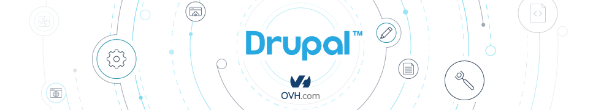

Gulp Drupal Stack
=================



This stack core is to be included in your main project and sets up many Gulp tasks that can work in many flexible ways by passing in different `config` objects, which can be based off of `gulpfile.default.yml` (and is merged with).


## Features

- SCSS => CSS compiling with LibSass, PostCSS, linting, CSScomb(x), and SourceMaps
- JS compiling via Babel, linting and aggregation
- Pattern Lab Twig compiling & BrowserSync live reload and style injection
- webpack module bundling
- SVG => Font Icons compiling with support for adding mixins and classes to SCSS along with a demo page
- Drupal file watching to trigger Drush cache clears
- Copy any files to an other location
- Sprite generator (with Retina Display support)

All is easily configurable by changing values in your `gulpfile.yml` file in your project. These values are merged into the `gulpfile.default.yml` file - look there for the available options and defaults.


## Prerequisites

- [Node](https://nodejs.org)
- [Gulp-cli](http://gulpjs.com/): `npm install -g gulp-cli`


## Installation

Follow theses steps:

```bash
$ cd <your-theme-or-module>
# (optional) init a new npm module
$ npm init
# Install it
$ npm install gulp-drupal-stack --save-dev
# Create a gulpfile.js
$ cp node_modules/gulp-drupal-stack/templates/gulpfile.js ./
# Create a gulpfile.yml (config file)
$ vi gulpfile.yml
# <set the config that you want, and save it>
```

### IDE/Text Editor Setup

- Install an EditorConfig plugin
- Ignore the indexing of these directories:
  - `node_modules/`
  - `bower_components/`
  - `dest/`
  - `pattern-lab/public/`
  - `pattern-lab/vendor/`


## Usage

See [Usage](usage.md) section.


## Credits

Original project from [p2-theme-core](https://github.com/phase2/p2-theme-core).


## License

MIT (original license)

---
